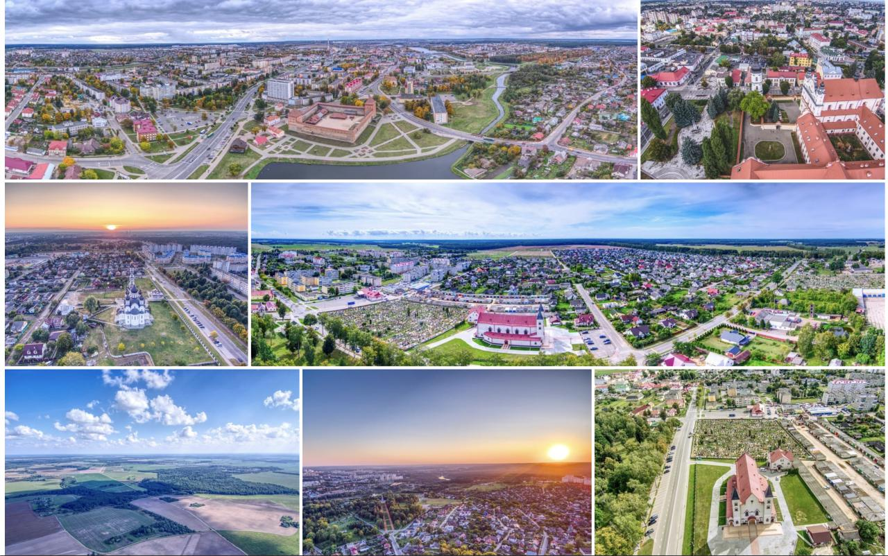

[](https://codeclimate.com/github/ngx-photo-gallery/monorepo/maintainability)
[](https://codeclimate.com/github/ngx-photo-gallery/monorepo/test_coverage)
[](https://travis-ci.com/ngx-photo-gallery/monorepo)


# ngx-photo-gallery

`@ngx-photo-gallery/mosaic` is an Angular component for displaying images which fills entire space without changing aspect ratio.



# Features

* Adding HTML template for display content over images
* AoT Compilation Support

# Installation

```
npm install --save @ngx-photo-gallery/mosaic
```
